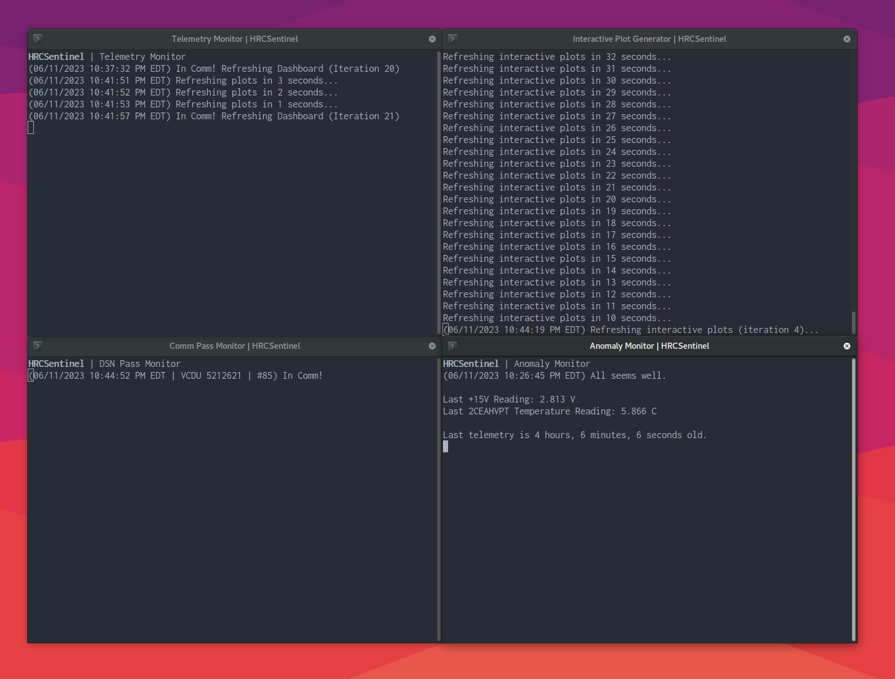
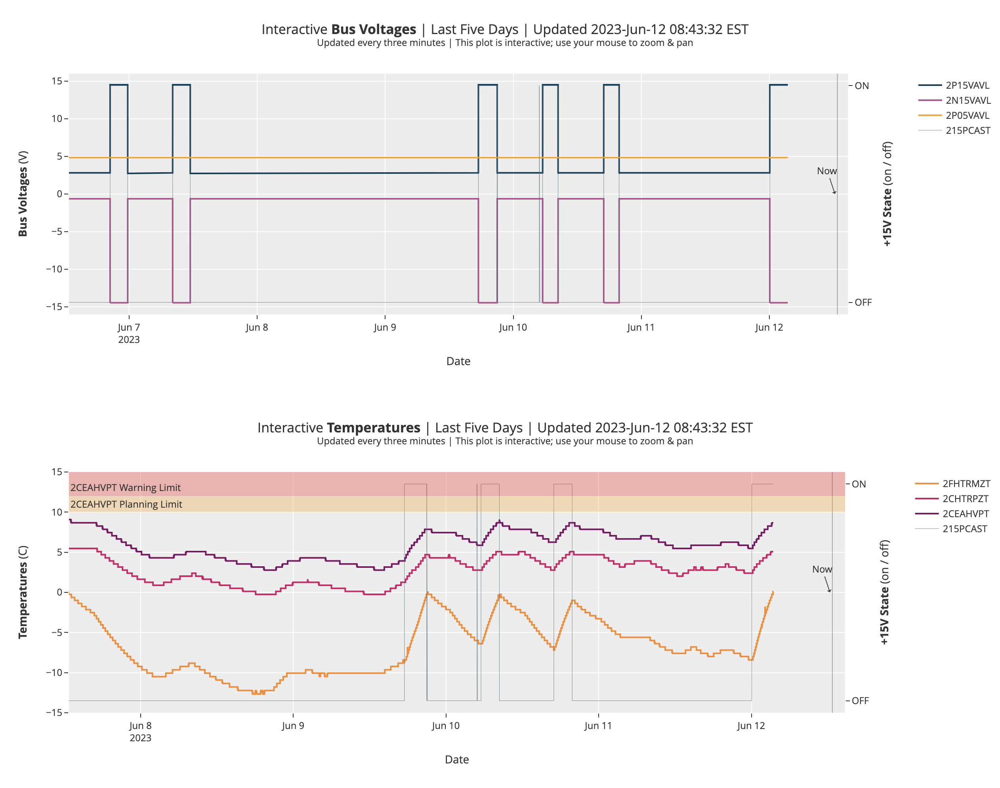
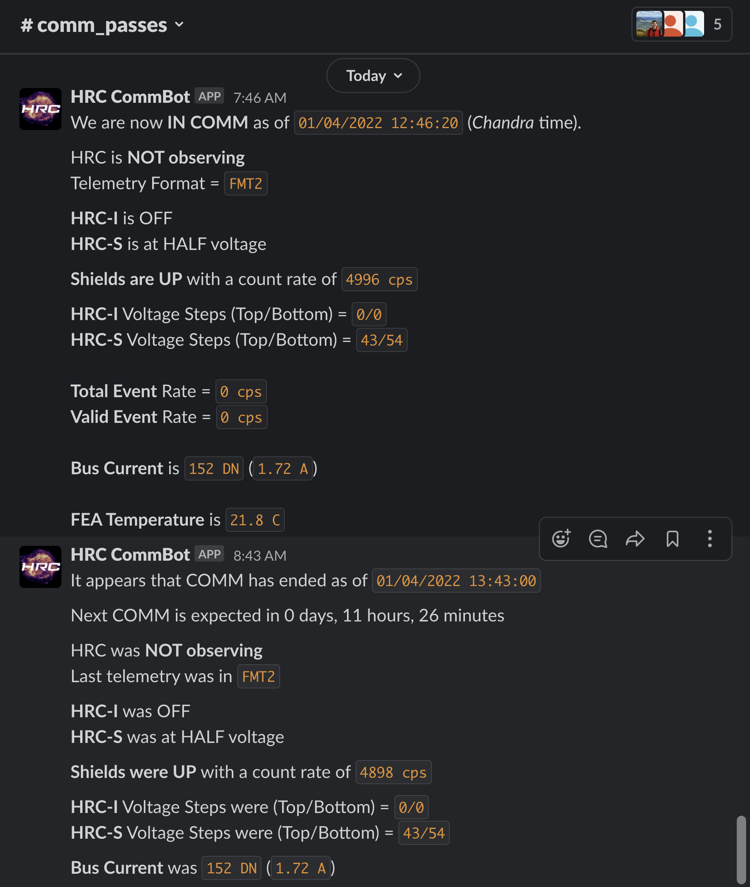
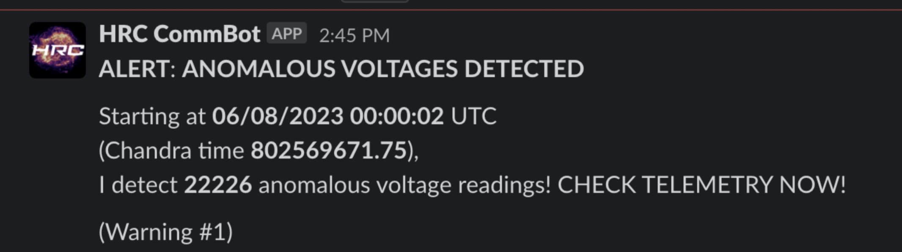
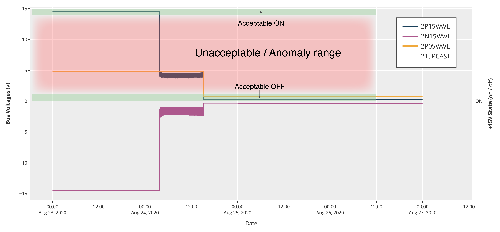
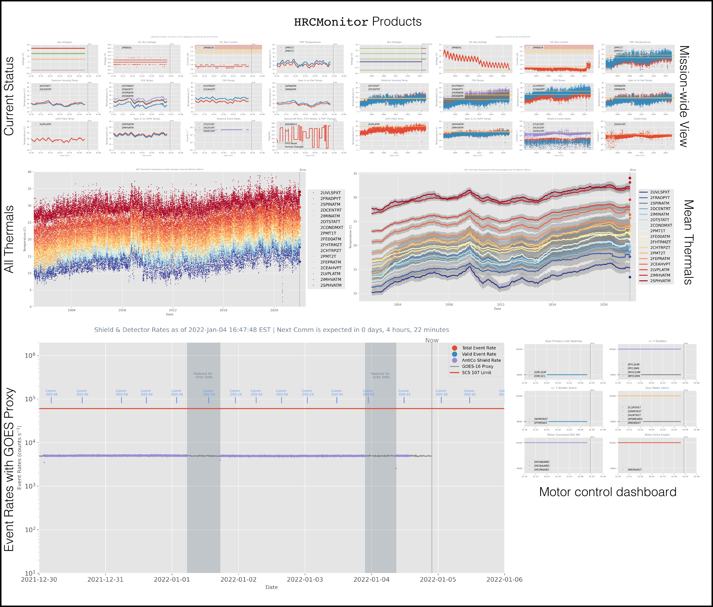

# HRCSentinel
__Real-time trending, telemetry auditing, and comm alerts for the *Chandra* High Resolution Camera__

`hrcsentinel` is a collection of Python scripts that enable real-time and backorbit telemetry monitoring (with associated team alerts) for *Chandra*'s High Resolution Camera (HRC). It was developed by [Grant Tremblay](www.granttremblay.com) of the HRC Instrument Principal Investigator Team in the wake of the [2020 and 2022 A- and B-side anomalies](https://cxc.cfa.harvard.edu/newsletters/news_31/article4.html) with the +15 V power supply bus. 

The codes are designed to run in the `Ska flight` environment on the [Center for Astrophysics](www.cfa.harvard.edu) High Energy Astrophyscis Division Linux network. It is also possible to run it on your own personal machine, provided you have the [`Ska3` runtime environment](https://github.com/sot/skare3/wiki/Ska3-runtime-environment-for-users) installed and initialized on your machine. Please note that, if you're running this on your personal machine, I have *some* code still hardwired to my personal setup (e.g. `/Users/grant/`), so you should either fix this yourself, or wait for me to do it! 

## Prerequisites & Caveats

This code requires
* Either that you are on the HEAD network (i.e. somewhere at the Center for Astrophysics), *or* that you have access to the SAO VPN, which must be connected if you're planning to run this code remotely. 
* Either direct access to the `Ska flight` runtime environment on the CfA HEAD Linux Network, *or* installation of the [`Ska3` runtime environment](https://github.com/sot/skare3/wiki/Ska3-runtime-environment-for-users) on your personal machine. 
* Because this code includes a (Slack)[www.slack.com] Bot to push alerts to the HRC Team, you will require access to the HRCOps Slack Workspace *and* a (Slack Bot `oauth` token)[https://api.slack.com/authentication/token-types] with the proper credentials to push bot notifications to channels within that workspace. Currently, Grant Tremblay and Ralph Kraft administer the Slack Workspace, and they are the only users with authority to generate the tokens. 

If you need help with any of the above requirements, see Grant Tremblay. 

Please note that this code relies *entirely* on the [`MAUDE` telemetry server](https://occweb.cfa.harvard.edu/twiki/bin/view/Software/MAUDE/WebHome), provided by the Flight Operations Team. We are single-strung on this: if *MAUDE* goes down, `hrcsetinel` goes down! Of course, the HRC SOT team does have several independent monitoring codes / interfaces that are totally separate from `MAUDE`. 

## Quick Start

### Installation
Nothing fancy here. Simply `git clone` this repository onto a local directory of your choice (presumably in your user account on the HEAD Linux Network). Stable code will always live in the `main` branch. Once cloned, `cd` to the `hrcsentinel` subdirectory within the repository and, if you're on the CfA HEAD LAN, run 
```
./start_hrcsentinel
```

This shell script will initailize the `Ska flight` environment and launch four `gnome terminal` windows. These will will independently run the four main `hrcsentinel` subroutines. On the HEAD LAN, these codes are stable against timeouts and `MAUDE` downtimes, and should run essentially indefinitely. 



## In more detail

`HRCSentinel` is composed of four main components:

* `monitor_telemetry.py`, which continually updates an instrument status dashboard. At this time, we host that dashboard [here](https://icxc.cfa.harvard.edu/hrcops/hrcmonitor/) (SAO VPN required). The status dashboard looks like this: 


* `plot_critical_interactives.py`, a separate script that produces *interactive* plots (using [Plotly](https://plotly.com/)) on the [telemetry status dashboard](https://icxc.cfa.harvard.edu/hrcops/hrcmonitor/). The interactive plots look like this: 



* `monitor_comms.py`, which listens for any active [DSN comm pass with *Chandra*](https://cxc.cfa.harvard.edu/mta/ASPECT/arc/) and reports critical real-time telemetry associated with that pass. It is meant to both alert the team that a comm pass has either just begun or just ended, and it provides a (non-exhaustive) quicklook at HRC's State of Health to bracket every pass. A comm pass slack alert looks something like this: 



* `monitor_anomaly.py`, which continuously scans the prior two days of HRC telemetry (including backorbit data from `MAUDE` as soon as it's populated in the wake of a comm pass), and searches for bad/anomalous telemetry that would signal a return of the [2020 and 2022 A- and B-side anomalies](https://cxc.cfa.harvard.edu/newsletters/news_31/article4.html). It also searches for violations of the (new as of 2023) 10 C `2CEAHVPT` planning limit, and any occurrances of `SCS 107`. If it finds any of the above, it will quickly send an alert to the Slack Workspace to alert the team. An anomaly alert looks (something like) this: 





## The HRC Status Dashboard

`monitor_telemetry.py` and `plot_critical_interactives.py` create a large number of plots that are viewable [here](https://icxc.cfa.harvard.edu/hrcops/hrcmonitor/). These plots include:

  * Interactive (zoomable / pannable) plots of the last five days of critical HRC telemetry (voltages, temperatures, and count rates). Any occurance of the anomaly will be immediately visible and inspectable here. 
  * A 12-pane status dashboard of all relevant HRC telelmetry (temperatures, voltages, etc.). These plots show all telemetry over a 7 day window. A vertical line is used to indicate the current time.
  * A continually updated plot of anti-coincidence shield and detector event rates. This plot includes markers for all scheduled DSN comm passes, the GOES HRC Shield Proxy, and upcoming scheduled HRC observations. 
  * Twenty-year mission-wide plots of all MSIDs shown on the current status dashboard. Yellow lines are used to indicate the very latest telemetry, so that currrent temperatures / voltages (etc.) can be compared with mission-wide trends.
  * Two detailed plots of thermal trending over the mission lifetime.
  * Motor Control status plots (which should *never* show state changes). 




### Testing, faking a comm pass, etc.

Both ```hrcmonitor``` and ```commbot``` accept the ```--fake_comm``` flag, which tricks the code into thinking that we are currently in comm. This allows for convenient testing of code functions that are specific to comm passes (sending Slack messages, refreshing plots at higher cadence, etc.)

Example:

```python
python hrcmonitor.py --fake_comm # Be constantly in a state of (fake) comm
python commbot.py --fake_comm    # same
```
