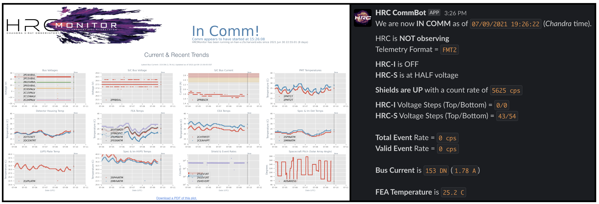

# HRCSentinel
__Real-time trending, telemetry auditing, and comm alerts for the *Chandra* High Resolution Camera__

While I've happily made this code public, it will unfortunately only work on *Chandra* [Operations Control Center](https://www.si.edu/newsdesk/releases/virtual-behind-scenes-tour-chandra-operations-control-center-now-available) EGSE machines and the [Center for Astrophysics](www.cfa.harvard.edu) LAN. This is because it heavily relies on *Chandra*-internal packages/tools, namely `MAUDE` (for real-time processed telemetry) and the `ska/cheta` archives (for long-term monitoring). *This code will therefore probably not work on your machine!*. If you are a *Chandra* Flight Operations Team member and you would like help adapting this code for your use, please contact [Grant Tremblay](www.granttremblay.com).  

`HRCSentinel` is composed of two main components: 

* `HRCMonitor`, which continually updates an instrument status dashboard which is (privately) hosted [here](https://icxc.cfa.harvard.edu/hrcops/hrcmonitor/) (SAO VPN required). 

* `HRCCommBot`, a Slack Bot that provides real-time DSN comm pass alerts with telemetry auditing. 

See the screenshots below for the output from these two codes: 



## How to run `HRCSentinel`

I run both codes on `han-v`, a CfA internal (virtual) machine. 

1. Initialize the `ska` Flight environment: 
`source /proj/sot/ska3/flight/bin/ska_envs.sh`
then,

`python hrcmonitor.py`

You can get help with:

```python
❯ python hrcmonitor.py --help
usage: hrcmonitor.py [-h] [--fake_comm] [--force_ska] [--report_errors] [--show_in_gui]

Monitor the VCDU telemetry stream, and update critical status plots whenever we are in comm.

optional arguments:
  -h, --help       show this help message and exit
  --fake_comm      Trick the code to think it's in comm. Useful for testing.
  --force_ska      Trick the code pull from Ska/CXC instead of MAUDE with a switch to fetch.data_source.set()
  --report_errors  Print MAUDE exceptions (which are common) to the command line
  --show_in_gui    Show plots with plt.show()
```

```python
❯ python commbot.py --help
usage: commbot.py [-h] [--fake_comm] [--report_errors]

Monitor the VCDU telemetry stream, and send a message to the HRC Ops Slack with critical HRC telemetry whenever we are in comm.

optional arguments:
  -h, --help       show this help message and exit
  --fake_comm      Trick the code to think it's in comm. Useful for testing.
  --report_errors  Print MAUDE exceptions (which are common) to the command line
```


### CommBot

