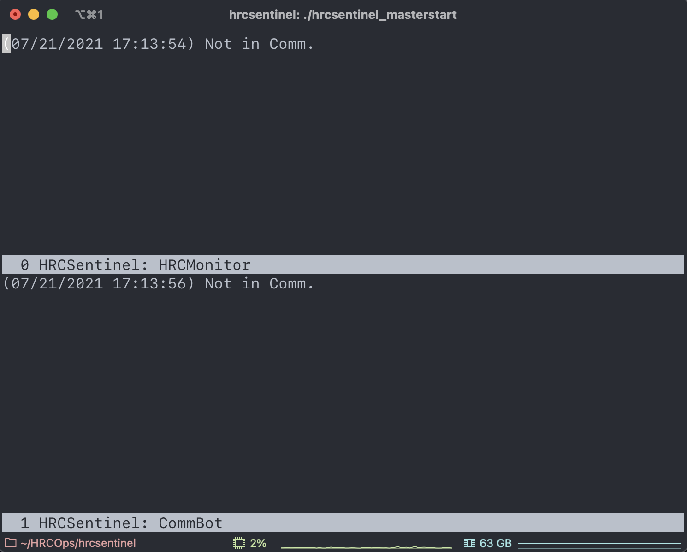

# HRCSentinel
__Real-time trending, telemetry auditing, and comm alerts for the *Chandra* High Resolution Camera__


`HRCSentinel` is composed of two main components:

* `HRCMonitor`, which continually updates an instrument status dashboard. At this time, we host that dashboard [here](https://icxc.cfa.harvard.edu/hrcops/hrcmonitor/) (SAO VPN required).

* `HRCCommBot`, a Slack Bot that provides real-time DSN comm pass alerts with telemetry auditing.

See the screenshots below for the output from these two codes:


While I've happily made this code public, it will unfortunately only work on *Chandra* [Operations Control Center](https://www.si.edu/newsdesk/releases/virtual-behind-scenes-tour-chandra-operations-control-center-now-available) EGSE machines and the [Center for Astrophysics](www.cfa.harvard.edu) LAN. This is because it heavily relies on *Chandra*-internal packages/tools, namely `MAUDE` (for real-time processed telemetry) and the `ska/cheta` archives (for long-term monitoring). *This code will therefore probably not work on your machine!*. If you are a *Chandra* Flight Operations Team member and you would like help adapting this code for your use, please contact [Grant Tremblay](www.granttremblay.com).

## How to run `HRCSentinel`

#### tl;dr
On a HEAD LAN machine such as `han-v.cfa.harvard.edu`, run
```shell
./hrcsentinel_masterstart
```
(or `sh hrcsentinel_masterstart`). This will launch a GNU `screen` session with two split panes that run `hrcmonitor` and `commbot` (the two primary components of `HRCSentinel`) independently and in parallel (as intended). The split `screen` looks like this (`hrcmonitor` is on the top, `commbot` is on the bottom):



`hrcsentinel` is primarily comprised of two separate codes, `hrcmonitor.py` and `commbot.py`, which I run independently on `han-v`, a CfA internal (virtual) machine.

Starting both codes should be as simple as:

`./hrc_masterstart` (or `sh hrc_masterstart`)


1. Initialize the `ska` Flight environment:
`source /proj/sot/ska3/flight/bin/ska_envs.sh` (I use an alias for this), then:

`python hrcmonitor.py`

You can get help with:

```
❯ python hrcmonitor.py --help
usage: hrcmonitor.py [-h] [--fake_comm] [--force_ska] [--report_errors] [--show_in_gui]

Monitor the VCDU telemetry stream, and update critical status plots whenever we are in comm.

optional arguments:
  -h, --help       show this help message and exit
  --fake_comm      Trick the code to think we are in comm. Useful for testing.
  --force_ska      Trick the code pull from Ska/CXC instead of MAUDE with a switch to fetch.data_source.set()
  --report_errors  Print MAUDE exceptions (which are common) to the command line
  --show_in_gui    Show plots with plt.show()
```

```
❯ python commbot.py --help
usage: commbot.py [-h] [--fake_comm] [--report_errors]

Monitor the VCDU telemetry stream, and send a message to the HRC Ops Slack with critical HRC telemetry whenever we are in comm.

optional arguments:
  -h, --help       show this help message and exit
  --fake_comm      Trick the code to think we are in comm. Useful for testing.
  --report_errors  Print MAUDE exceptions (which are common) to the command line
```


### CommBot

```commbot.py``` calls ```heartbeat.py``` to monitor the VCDU counter MSID in MAUDE and look for increments, indicating that we are currently in DSN comm with Chandra. When these VCDU increments are first detected, ```commbot``` sends a Slack message to a dedicated channel in our private HRCOps Slack Workspace.

```python
python commbot.py --report_errors
```

### Other utilities

You can also call `plot_dashboard.py` directly from the command line for a custom dashboard view with
user-defined date ranges and data sampling. For example,

```python
python plot_dashboard.py --start 2001-07-17 --stop 2012-05-21 --sampling daily
```

### Testing, faking a comm pass, etc.

Both ```hrcmonitor``` and ```commbot``` accept the ```--fake_comm``` flag, which tricks the code into thinking that we are currently in comm. This allows for convenient testing of code functions that are specific to comm passes (sending Slack messages, refreshing plots at higher cadence, etc.)

Example:

```python
python hrcmonitor.py --fake_comm # Be constantly in a state of (fake) comm
python commbot.py --fake_comm    # same
```